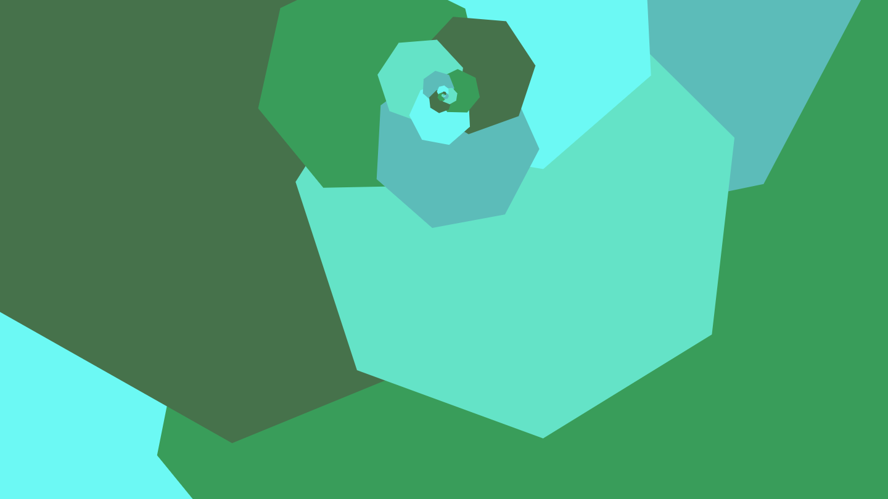

# Dessin

Dessin is an interactive pattern generator using recursive geometry.

Play around with the sliders and watch the shapes transform in real time!


## Live Demo
[https://paralogia.github.io/dessin/](https://paralogia.github.io/dessin/)

## Controls:
* Left click: Play/Pause
* Right click: Context Menu (you can save/copy the image)
* Slider parameters (left-to-right/top-down):
  * Scaling Factor
  * Rotation Angle
  * Polygon Sides
  * Displacement
  * Animation Speed

## Technologies/Technical Challenges
Dessin is implemented using JavaScript and rendered on an HTML5 canvas. Future iterations may incorporate SVGs for scalable images.

### Fixed Point Computation
In order to produce self-similar images, the program starts with a single polygon. Next. it repeatedly draws and then applies an [affine transformation](https://en.wikipedia.org/wiki/Affine_transformation) to the figure, until a certain depth is reached. Some transformations will appear to converge at some point other than the center, as in the figure below:



This convergence point, also known as a fixed point, is a natural center of rotation when animating the figure, so I wrote some utility functions to compute this fixed point using a matrix representation of the affine transformation. For the mathematically-minded, this boils down to finding the eigenvector of the matrix that corresponds to the eigenvalue of 1.

```js
// Finds the fixed point of an affine transformation represented by a 3x3 matrix
// Note: Input matrix should be formatted like a DOMMatrix from the Canvas API
function fixedPoint(matrix) {
  const { a, b, c, d, e: dx, f: dy } = matrix;

  const subMatrix = [
    [ 1-a,  0-c ],
    [ 0-b,  1-d ]
  ]
  const invSubMatrix = invertMatrix(subMatrix);
  const transVec = [dx, dy];
  return matVecMultiply(invSubMatrix, transVec);
}

// Inverts a matrix representing an affine or linear transformation
function invertMatrix(matrix) {
  const [[a, c, dx], [b, d, dy], ..._] = matrix;
  
  const det = a*d - b*c; 

  if (dx || dy) {
    // Affine
    return [
      [  d/det,   -c/det,   (c*dy-d*dx)/det ],
      [ -b/det,    a/det,   (b*dx-a*dy)/det ],
      [ 0,         0,       1               ]
    ]
  } else {
    // Linear
    return [
      [  d/det,   -c/det ],
      [ -b/det,    a/det ]  
    ]
  }
}

function matVecMultiply(mat, vec) {
  const res = vec.map(() => 0);
  for (let i = 0; i < mat.length; i++) {
    for (let j = 0; j < vec.length; j++) {
      res[i] += vec[j]*mat[i][j];
    }
  }
  return res;
}
```

## Example Patterns

Discover your own fascinating patterns!


## Credits
* [*Styling Cross-Browser Compatible Range Inputs with Sass*](https://github.com/darlanrod/input-range-sass). Darlan Rod.
