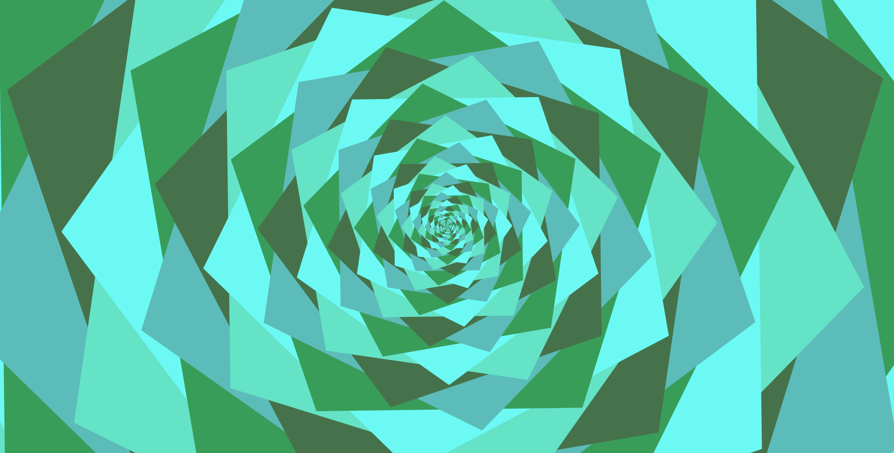
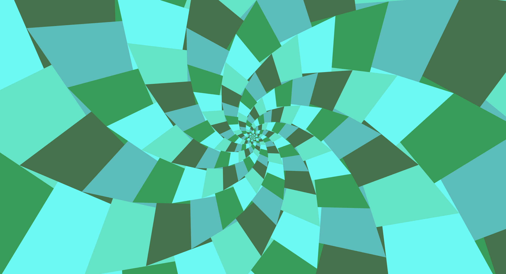
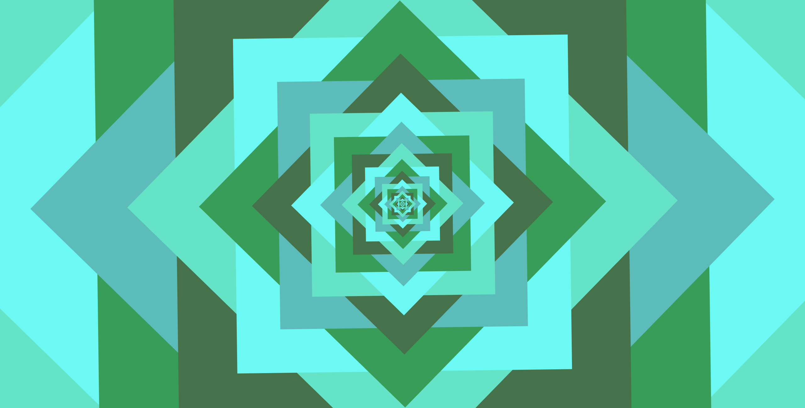
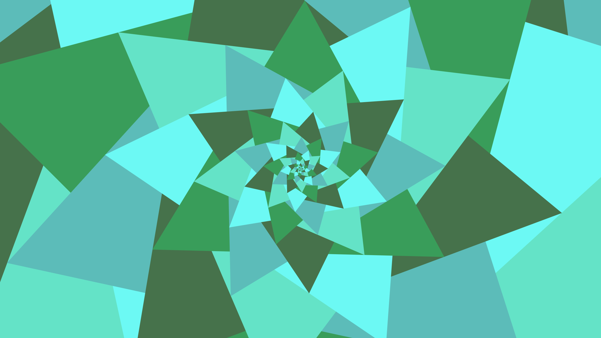
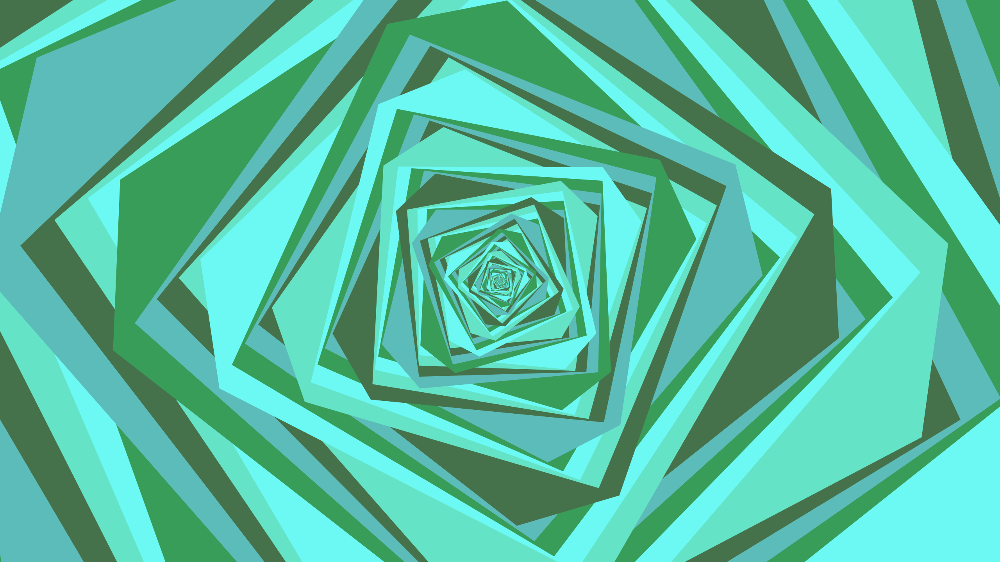

# Dessin

Dessin is an interactive pattern generator using recursive geometry.

Play around with the sliders and watch the shapes transform in real time!

## Live Demo
[https://paralogia.github.io/dessin/](https://paralogia.github.io/dessin/)

## Controls:
* Left click: Play/Pause
* Right click: Context Menu (you can save/copy the image)
* Slider parameters (left-to-right/top-down):
  * Scaling Factor
  * Rotation Angle
  * Polygon Sides
  * Displacement
  * Animation Speed

## Technologies
Dessin is implemented using JavaScript and rendered on an HTML5 canvas. Future iterations may incorporate SVGs for scalable images.

## Example Patterns

Discover your own fascinating patterns!

